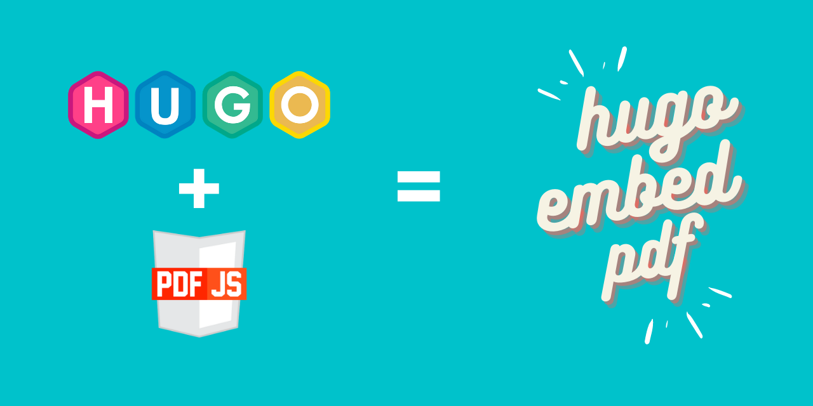

[](https://badges.mit-license.org) 
# hugo-embed-pdf-shortcode  

---  
# Table of Contents  

* [Online Demo](https://hugo-embed-pdf.netlify.app/)
* [Introduction](#introduction)
* [Setup](#setup)  
* [Usage](#usage)  
* [FAQ](#faq)  
* [Support](#support)  
* [Who uses embed-pdf](#who-uses-hugo-embed-pdf-shortcode)
* [License](#license)  

---

## Introduction
[\[Back to Top\]](#table-of-contents)

This is a [Hugo Shortcode](https://gohugo.io/extras/shortcodes/) developed for use in [Hugo](https://gohugo.io/) based websites. This shortcode allows you to embed a PDF file in a page on your Hugo website. It is developed using the [PDF.js](https://mozilla.github.io/pdf.js/) library by Mozilla.



## Setup
[\[Back to Top\]](#table-of-contents)

**Note:**  This shortcode is for use in Hugo based websites. It will not work anywhere else.

Hugo embed-pdf can be installed in two ways.

### Method 1 - Install as a Git submodule

1. Add this shortcode as a Git submodule

```shell
git submodule add  https://github.com/anvithks/hugo-embed-pdf-shortcode.git themes/hugo-embed-pdf-shortcode
```

2. Edit `config.toml` as follows

```
theme = ["hugo-embed-pdf-shortcode", "YourCurrentTheme"]
enableInlineShortcodes = true
```

**To learn more about "Theme components", see [the Hugo documentation](https://gohugo.io/hugo-modules/theme-components/)**

<hr />

### Method 2 - Clone this repository

1. Clone this repository
<br />

```shell
git clone https://github.com/anvithks/hugo-embed-pdf-shortcode.git
cd hugo-embed-pdf-shortcode
```

2. Copy the file `./layouts/shortcodes/embed-pdf.html` to  `./layouts/shortcodes` in your Hugo website directory.  
<br />

**Note:** If you do not have a `./layouts/shortcodes` directory you can create it.  

```shell
cp ./layouts/shortcodes/embed-pdf.html /path/to/your/hugo/website/layouts/shortcodes
```  
<br />

3. Copy the pdf.js library files from `./static/js/pdf-js` to `./static/js` in your Hugo website directory.  
<br />

**Note:** If you do not have a `./static/js` directory you can create it.  

```shell
cp -R ./static/js/pdf-js /path/to/your/hugo/website/static/js/
```  
<hr />

## Usage  
[\[Back to Top\]](#table-of-contents)

In your Hugo website place the following shortcode in any of the markdown pages. 
```


```

To hide pagination
```

```


To render a selected page number
```

```

To hide loading spinner
```

```

### Parameters
- **url (required)** : The relative location of the file.  

- **hidePaginator (optional)**: Boolean which expects `true` or `false`. Hides the paginator for single page documents. 

- **renderPageNum (optional)**: Integer which expects any number from `1` up to the last page number in the document. Will render that specific page on initial load.

- **hideLoader (optional)**: Boolean which expects `true` or `false`. Hides the loading spinner while your document loads. 

<br />

**Note:** Currently supports local file embed. If absolute URL from the remote server is provided, configure the CORS header on that server.


## FAQ  
[\[Back to Top\]](#table-of-contents)

1. I have installed hugo-embed-pdf in my website locally by cloning the repository and copying the files, but it does not work?  
A. hugo-embed-pdf uses pdf.js from mozilla. Pdf.js is now being served using a CDN.  
If you would like to use a local copy of PDf.js then you can make the following changes to the `embed-pdf.html` file.
- Change the script tag at the top of the file from
```js
<script src="https://cdn.jsdelivr.net/npm/pdfjs-dist@3.4.120/build/pdf.min.js" integrity="sha256-UZQVSEoMbJ82/3uFjt4mYOTVVHIImtkp7u3L6LMH6/Y=" crossorigin="anonymous"></script>
```

**to**  

```js
<script type="text/javascript" src='{{"/js/pdf-js/build/pdf.js" | relURL}}'></script>
```
- Change the path to the `pdf.worker.js` file at line number 124 from  

```js
pdfjsLib.GlobalWorkerOptions.workerSrc = 'https://cdn.jsdelivr.net/npm/pdfjs-dist@3.4.120/build/pdf.worker.min.js';
```

**to**  

```js
pdfjsLib.GlobalWorkerOptions.workerSrc = "{{.Site.BaseURL}}" + 'js/pdf-js/build/pdf.worker.js';
```

## Support  
[\[Back to Top\]](#table-of-contents)
You an reach me at:
- Twitter : [@anvith3](https://twitter.com/anvith3)

For any bugs, enhancement requests, feature requests please raise issues [here](https://github.com/anvithks/hugo-embed-pdf-shortcode/issues)

## Who uses Hugo Embed Pdf Shortcode
[\[Back to Top\]](#table-of-contents)

[Dirk's Changelog](https://changelog.deimeke.ruhr/2019/08/11/workshop-20190811/)  
[SYSADMIN - Administration, security and hardening of Linux](https://sysadmin.info.pl/pl/blog/moja-praca-inzynierska/)  

## License  
[\[Back to Top\]](#table-of-contents)

[](https://badges.mit-license.org)

- **[MIT license](https://opensource.org/licenses/mit-license.php)**
